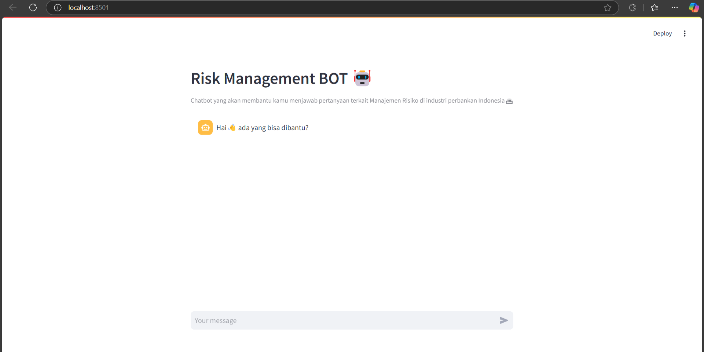
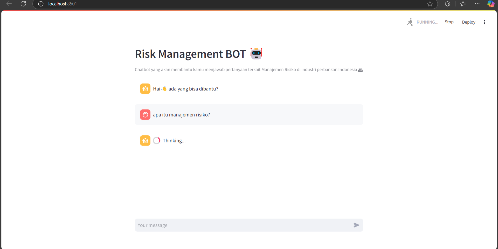
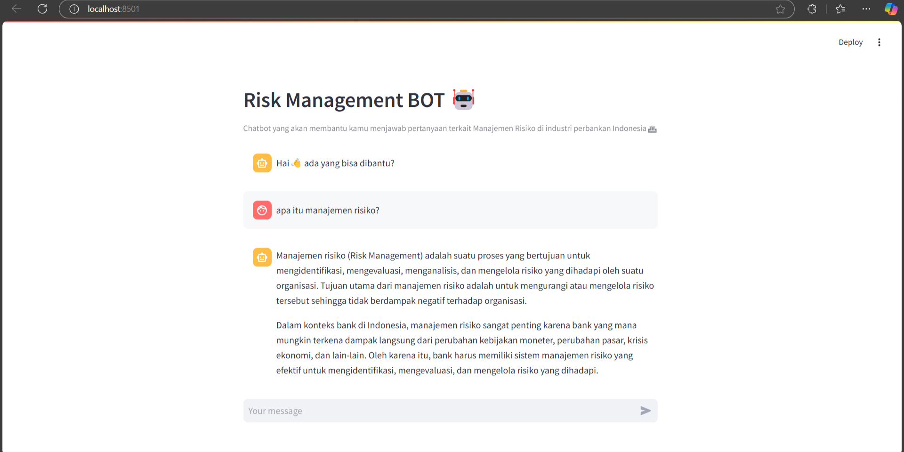
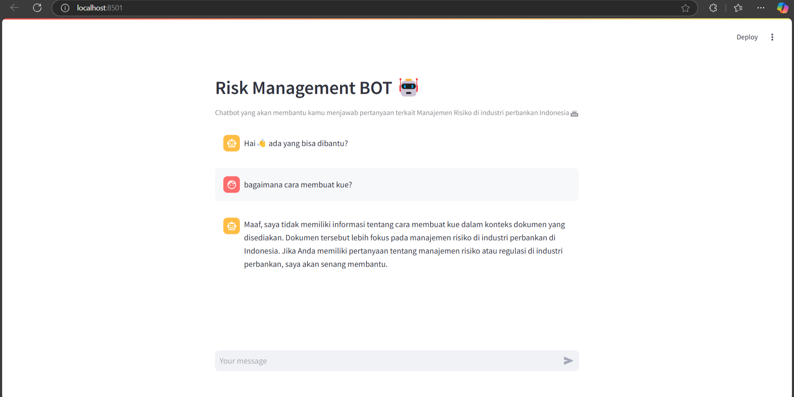

# Risk Management Chatbot

## Project Descriprion
This project provides a solution for anyone who wants to learn about risk management in banking industry, especially in Indonesia. Users can ask questions about risk management directly through a chatbot interface.

This project using application of Retrieval Augmented Generation (RAG) using python code in Visual Studio Code virtual environment. The application frontend is built with Streamlit, and the backend leverages the power of LangChain and Ollama for processing and answering questions. The application allows the use of different Large Language Models (LLMs) for the chatbot and different embeddings for documents retrieval. This project using Llama 3.2:3b for LLM and FastEmbedEmbedding for embeddings due to the limitation of owner's PC specification.

## Features
- **Chatbot Interface:** Ask questions about risk management in banking indutry
- **Model Flexibility:** Choose from various LLMs to process and generate responses, using models sourced via Ollama. Choose from various Embeddings to retrieve documents, using embeddings provided in Langchain.
- **Streamlit Frontend:** Interactive and user-friendly UI built with Streamlit.
- **RAG Approach:** Combines document retrieval and augmented generation for accurate answers.

## Getting started

### Prerequisites
- Python 3.11 or higher
- pip (Python package installer)
- Visual Studio Code
- Ollama

### Installation
1. Clone this repository:
   ```bash
   git clone https://github.com/forfiay/manrisk-chatbot
2. Install the Required Python Packages::
   ```bash
   pip install -r requirements.txt
3. Install the LLM Model using Ollama:
   ```bash
   ollama pull llama3.2:3b

### Usage
1. Run main.py
2. Run app.py
3. Start the Streamlit App::
   ```bash
   streamlit run app.py

## Screenshots





## Conclusion
Congratulations, now you equipped with the necessary information to build Chatbot RAG related to Risk Management in Banking Industry. The responses might not be 100% accurate due to the chosen fast-lightweight embeddings and LLM model in this project, but it may improve if you choose the better one, as the source documents provided already fulfill all basic information needed. Happy generating!
